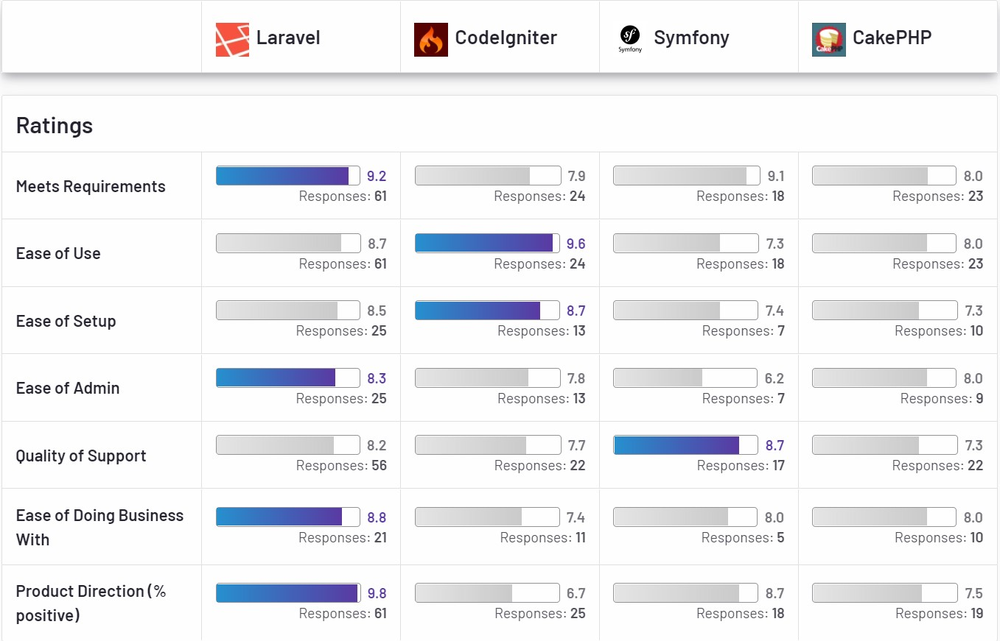

# লারাভেল কি?

লারাভেল অত্যন্ত জনপ্রিয় একটি পিএইচপি ওয়েব অ্যাপ্লিকেশন ফ্রেমওয়ার্ক।  ২০১১ সালে টেইলর ওটেল \([@Taylor Otwel](https://medium.com/@taylorotwell)\) এর হাত ধরে লারাভেল ফ্রেমওয়ার্ক এর যাত্রা শুরু হয়।

[g2.com](https://www.g2.com/compare/laravel-vs-codeigniter-vs-symfony-vs-cakephp) এর জরিপে পিএইচপির ফ্রেমওয়ার্কগুলোর তুলনা দেখা যাক এবার,

