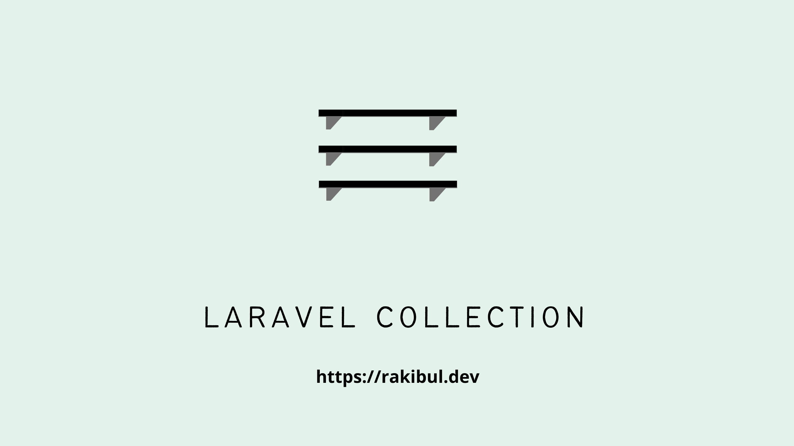

# কালেকশন \(collection\) কি?



যেকোন অ্যারে কে `collect()` হেল্পার দিয়ে খুব সহজেই কালেকশন এ রুপান্তর করা যায়। যেমন,

```php
$arr = [1,2,3];
$coll = collect([1,2,3]);

/*
Illuminate\Support\Collection {#1277 ▼
  #items: array:3 [▼
    0 => 1
    1 => 2
    2 => 3
  ]
}
*/
```

প্রশ্ন হচ্ছে php এর ডিফল্ট অ্যারে ফাংশনগুলো দিয়েই তো কাজ হয়ে যায়,   কালেকশন ব্যবহার করবো কেন?

আচ্ছা ধরুন, দুটো অ্যারে থেকে কমন ভ্যালুগুলো শাফল করে দেখাতে হবে। কিভাবে করবেন? কনভেনশনাল php তে আমরা এভাবে লিখতে পারি,

```php
shuffle(arsort(array_unique(array_merge($array1,$array2))));
```

এত্তগুলো **ব্র্যাকেট!!** আচ্ছা এবার যদি আরেকটু কমপ্লেক্স করে লিখতে বলা হয়, ১০ কিংবা তারও বেশি ব্র্যাকেট!  কি! খেই হারিয়ে ফেললেন? পড়তেও দাঁতমুখ ভাঙ্গার যোগার না?


এবার তাহলে চলুন কালেকশন দিয়ে করে দেখি,

```php
collect($array1)
     ->merge($array2)
     ->unique()
     ->sort()
     ->shuffle();
```

সহজ মনে হচ্ছে না? 

আবার যেমন নিচের কোডটুকু দেখুন, এখানে কোথায় প্যারামিটার বসাতে হবে এই নিয়েই দ্বিধা-দ্বন্দ্বে ভুগতে থাকেন অনেকে।

```php
array_walk ( $array , $callback );
array_map ( $callback , $array);
array_merge ( $array ,$array2 );// return a new array
array_push ($array ,$value); // not return a new array
```

লারাভেল কালেকশন দিয়ে খুবই সিম্পল ও সহজভাবে কাজটি করে ফেলা যায়।

```php
collect($array)
    ->each($callback)
    ->map($callback)
    ->merge($array2)
    ->push($value)
```

আবার কী দিয়ে লারাভেল কালেকশন অ্যারে প্রসেসিং এ অনেক সহজ। এবং  **মাল্টি লেয়ার অ্যারের ডিপ লেভেলও খুব সহজভাবে এক্সেস করা যায়**, যেখানে পিএইচপি কনভেনশনাল অ্যারে এপিই এর বেশিরভাগই শুধুমাত্র টপ লেয়ারে এক্সেস করতে পারে। যেমন,

```php
$array=[
    ["id"=>1,"product"=>['name'=>"Apple"]],
    ["id"=>2,"product"=>['name'=>"Watermelon"]],
    ["id"=>3,"product"=>['name'=>"Banana"]],

];

$result= collect($array)->sortBy("product.name");

/*
Illuminate\Support\Collection {#3545 ▼
  #items: array:3 [▼
    0 => array:2 [▼
      "id" => 1
      "product" => array:1 [▼
        "name" => "Apple"
      ]
    ]
    ...........
  ]
}

*/
```

লারাভেল কালেকশন **'ম্যাক্রোয়েবল' ।**এর মানে হলো, আপনি চাইলেই খুব সহজেই কালেকশন যেকোন মেথড যোগ করতে পারবেন। যেমন, কোন অ্যারের সবগুলো ভ্যালুকে যদি বড় হাতের অক্ষরে দেখতে চান তাহলে,

```php
use Illuminate\Support\Collection;
use Illuminate\Support\Str;

Collection::macro('toUpper', function () {
    return $this->map(function ($value) {
        return Str::upper($value);
    });
});

$collection = collect(['first', 'second']);

$upper = $collection->toUpper();

// ['FIRST', 'SECOND']
```

আরও একটি মজার তথ্য দিয়ে রাখি, আপনি চাইলে কালেকশন ক্লাসটি লারাভেল এর বাইরেও ব্যবহার করতে পারবেন। 

```php
composer require illuminate/support
```

